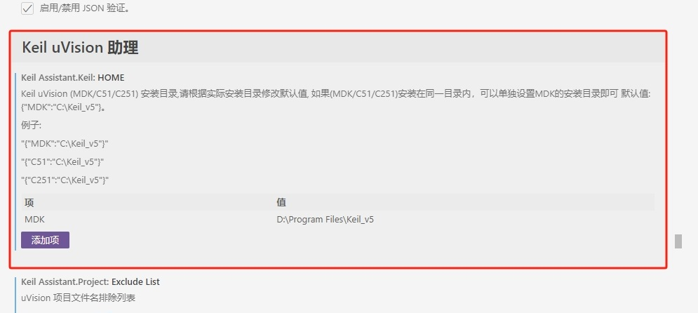
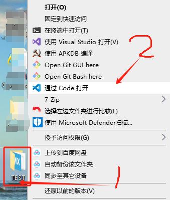
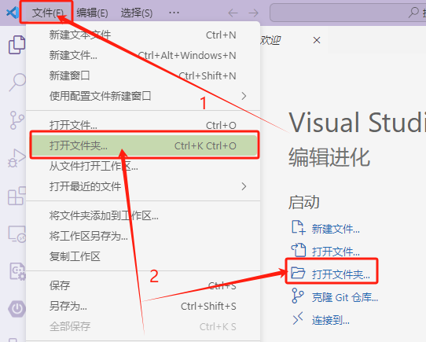
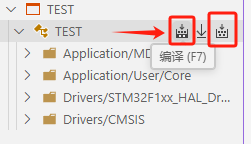

<div align="center">
<h1>Keil Assistant</h1>


 
[](https:/github.com/jacksonjim/keil-assistant)
[](https:/github.com/jacksonjim/keil-assistant)
<!-- [](https:/github.com/jacksonjim/keil-assistant) -->
[](https:/github.com/jacksonjim/keil-assistant)


</div>

---
## [English📄](./README_EN.md)
---

## 简述 📑

vscode 上的 Keil 辅助工具，与 c/c++ 插件配合使用.

能够为 Keil 项目提供 语法高亮、代码片段 的功能，并支持对 keil 项目进行 编译、下载。

**[关于Keil助手插件的下载的默认快捷键是否需要调整为F8键来做个调查](https:/github.com/jacksonjim/keil-assistant/discussions/20)**

**仅支持 Keil uVison 5 及以上版本**

**仅支持 Windows 平台**


---

## 功能特性 🎉

- 加载 Keil C51/C251/ARM 项目，并以 Keil 项目资源管理器的展示方式显示项目视图
- 自动监视 keil 项目文件的变化，及时更新项目视图
- 通过调用 Keil 命令行接口实现 编译，重新编译，烧录 keil 项目
- 自动生成 c_cpp_properties.json 文件，使 C/C++ 插件的语法分析能正常进行
- 支持调用命令生成 compile_commands.json（快捷键`ctrl+shift+p`, 搜索`生成compile_commands.json(仅MDK)`）

---
## 下载📌
 [ Visual Studio Marketplace](https://marketplace.visualstudio.com/items?itemName=jacksonjim.keil-vscode-assistant)
---

## 用法 📖

### 准备工作

1. 安装 C/C++ 插件

2. 进入 Keil-Assistant 插件设置，~~设置好 keil 可执行文件 UV4.exe 的绝对路径~~ 
- v1.7.2 以前的配置保持不变
  
  

- v1.7.3+ 版本开始只需要配置Keil安装目录即可，简化相关配置项目(默认目录为:C:\Keil_v5)

- v1.8.0+ 版本方便部分用户需要单独设置C51或C251安装目录增加一个可选项设置，默认只需要设置MDK的安装目录即可，仅支持: MDK, C51, C251; 详情参考设置中有示例
  
  

- v1.9.3+ 版本⚠️调整支持最低vscode engines的版本为 V1.73.0+的VsCode, 麻烦请更新为V1.73.0后的版本,此次调整因为多语言版本最低支持的版本为1.73.0; [**l10n** 此API在VS Code 1.73 中引入](https://github.com/microsoft/vscode-l10n/blob/main/README.md)

---


### 开始使用 🏃‍♀️

1. 在 Keil 上创建好项目，添加好文件，头文件路径等, 或是使用其它工具[STM32cubemx]生成keil 项目文件

2. 点击 **打开项目** 图标 或者 **使用 vscode 直接打开 keil 项目文件(.uvproj) 所在的目录**，插件会自动加载 keil 项目;
   
  - 打开*.uvproj项目文件
  
    

  - 快捷打开项目方式1  **右击项目根文件夹 --> 通过vscode打开**
    
    
  
  - 快捷打开项目方式2  **在vscode中--> 文件--打开文件夹(快捷键：Ctrl+k Ctrl+O), 选择项目所在的目录**
    
    

### 常用操作

- **编译(F7)，烧录(F8)**：提供了 3 个按钮，分别代表 编译，下载，重新编译

  


- **保存和刷新**：在 Keil 上添加/删除源文件，更改，配置项目，更改完毕后点击 **保存所有**，插件检测到 keil 项目变化后会自动刷新项目

  


- **打开源文件**：单击源文件将以预览模式打开，双击源文件将切换到非预览模式打开

  


- **切换 c/c++ 插件的配置**：点击目标名称在多个 c/c++ 配置中切换

  


- **切换 keil Target(CTRL+T)**：点击项目的切换按钮，可以在多个 Keil Target 之间切换

  


- **展开引用**：在编译完成后，可以点击源文件项的箭头图标展开其引用（仅支持 ARM 项目）

  

---

### 其他设置

- 工作区设置：项目排除列表(`KeilAssistant.Project.ExcludeList`)
  当某个目录下存在多个 keil 项目时，使用插件打开该目录，插件会加载所有的 keil 项目，通过此选项，可以指定需要排除哪些 keil 项目，防止在打开该工作区时自动加载该项目
  **默认的排除列表**：
  ```json
  ["template.uvproj", "template.uvprojx"]
  ```

### 关于 C51/C251 的中断提示问题

- 在代码头文件中加入以下代码替换，即可
- C51 代码部分

```c
#ifndef __VSCODE_C51__
#define INTERRUPT(x) interrupt x
#else
#define INTERRUPT(x)
#endif
```

- C251 代码部分

```c
#ifndef __VSCODE_C251__
#define INTERRUPT(x) interrupt x
#else
#define INTERRUPT(x)
#endif

```

- 示例代码使用

```c
void UART1_int(void) INTERRUPT(UART1_VECTOR)
{
    if (RI)
    {
      RI = 0;
    }

    if (TI)
    {
      TI = 0;
    }
}
```

### 还有其他问题 ？

可以到以下位置进行交流

- [论坛: https://discuss.em-ide.com/t/keil-assistant](https://discuss.em-ide.com/t/keil-assistant)

- [Github Issue: https:/github.com/jacksonjim/keil-assistant/issues](https:/github.com/jacksonjim/keil-assistant/issues)
